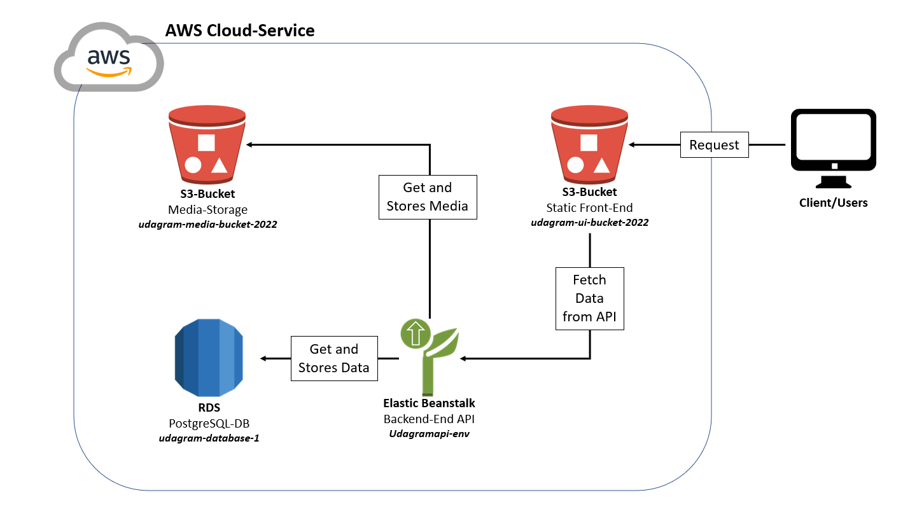

# Infrastructure

## AWS

### RDS PostgreSQL Database

DB-Instance-Name: `udagram-database-1`

URL: `udagram-database-1.cp1eavn4eqgl.us-east-1.rds.amazonaws.com`

Port: `5432`

AWS RDS Database Service: Relational database to storing information data

### Elastic Beanstalk

Env-Name: `Udagramapi-env`

URL: `Udagramapi-env.eba-zk3spmmd.us-east-1.elasticbeanstalk.com`

AWS Elastic Beanstalk Service: The server runs on Elastic Beanstalk and provide the API. Back-End API build files are stored on S3 Storage Service.

### S3 Buckets

In sum there are three S3-Buckets.

**Front-End:**

ARN: `udagram-ui-bucket-2022`

URL: `http://udagram-ui-bucket-2022.s3-website-us-east-1.amazonaws.com `

The front-end build is hosted on a S3-Bucket that is publicitly reachable and configured for hosting static websites.

**Media-Storage:**

ARN: `udagram-media-bucket-2022`

The media-storage stores the media-files that are uploaded. The back-end have a connection to this bucket.

**Backend-Build-Storage:**

ARN: `elasticbeanstalk-us-east-1-921195254821`

This S3-Bucket stores the back-end builds. The builds are deployd with eb-cli via pipeline.
